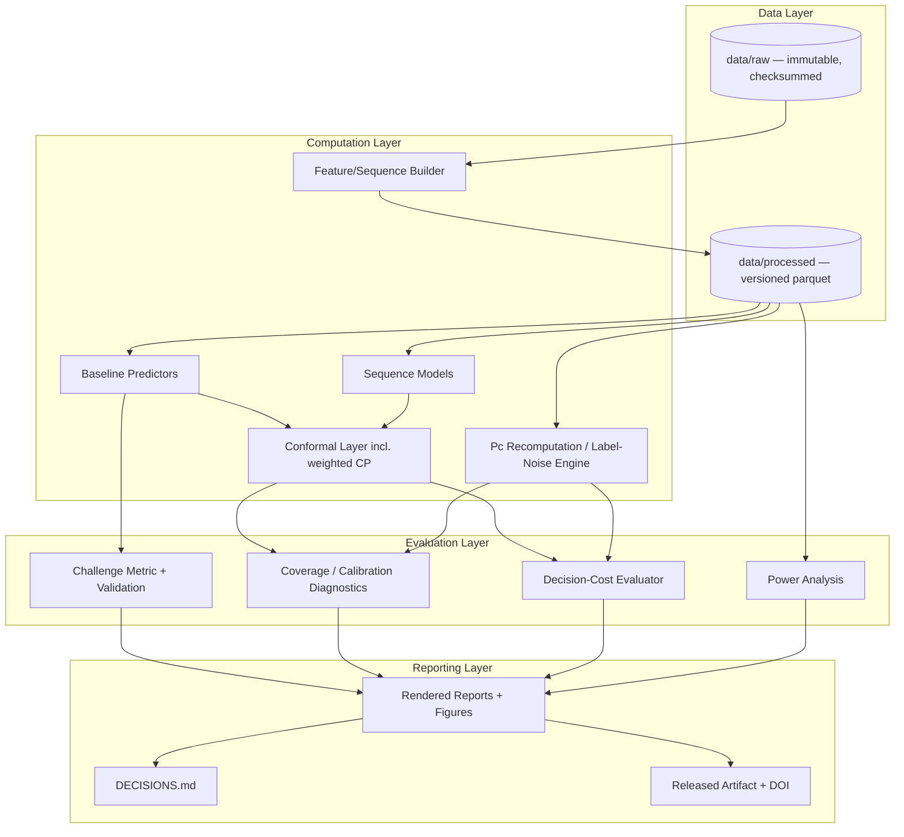
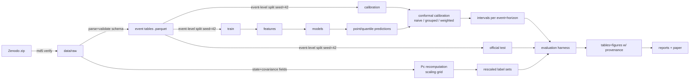
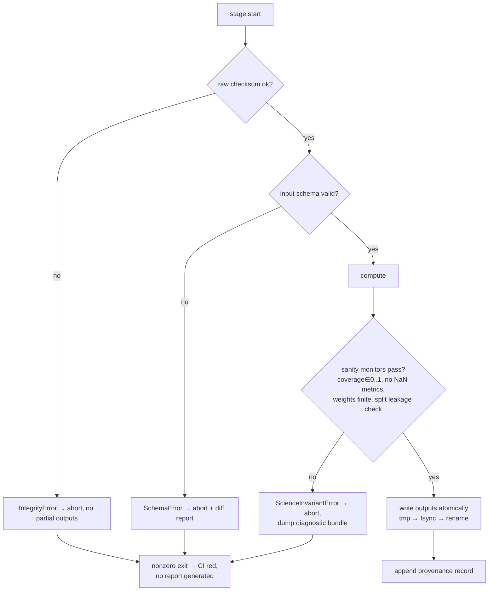
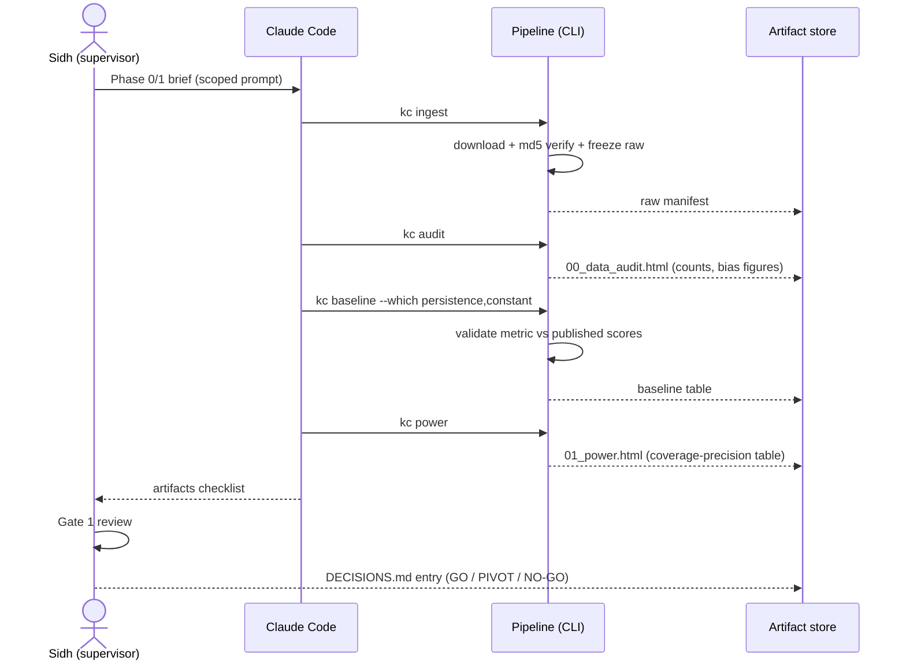
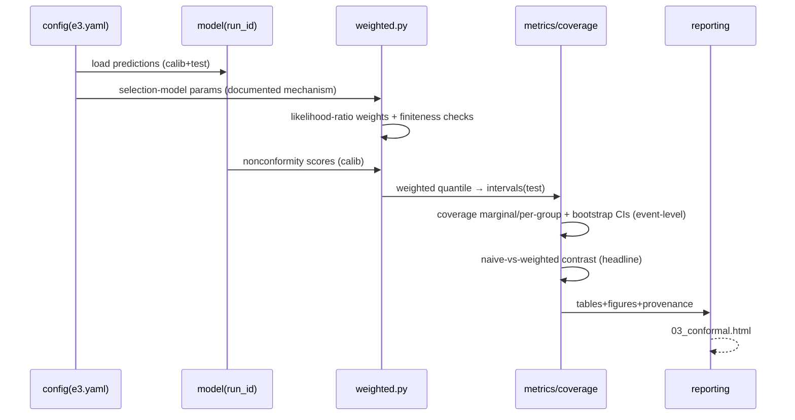
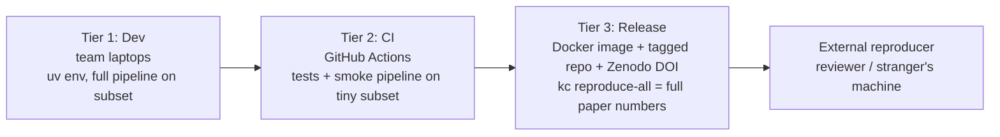

# SOFTWARE_ARCHITECTURE.md
**Project:** Calibrated Collision Risk Forecasting for Satellite Conjunction Assessment
**Document status:** Implementation-ready. Governed by PROJECT_KNOWLEDGE.md (if the two conflict, PROJECT_KNOWLEDGE.md wins or is consciously amended).
**Honest scoping note:** This is a *reproducible research pipeline*, not a web service. Sections that a generic architecture template aims at online systems (API flow, authentication, deployment) are interpreted here in their research-system equivalents — internal interfaces, artifact integrity, and reproducibility environments — rather than padded with fictional REST endpoints and user auth the project does not need. A senior engineer should be able to implement the system from this document alone.

---

## 1. Overall Architecture

**Style:** Layered batch pipeline with strict one-way data flow and gated stages. Four layers:

1. **Data layer** — immutable raw store → versioned processed store. No component ever writes upstream.
2. **Computation layer** — pure, deterministic, seeded transformations: feature building, models, conformal wrappers, label recomputation.
3. **Evaluation layer** — the metrics/coverage/decision-cost harness. The only layer allowed to produce "numbers that appear in the paper."
4. **Reporting layer** — executed notebooks/reports, figures, the decisions log, and the packaged artifact.

**Architectural invariants (enforced, not aspirational):**
- I1. Raw data directory is read-only after Phase 0 (filesystem permission + checksum check at every pipeline start).
- I2. Every artifact is a pure function of (raw data, config, code version, seed). No hidden state, no manual edits.
- I3. Event-level integrity: all splits, calibration sets, and bootstrap resampling operate on whole events, never individual CDMs, to prevent leakage/pseudo-replication.
- I4. Every number in a report carries provenance metadata (git commit, config hash, seed set).
- I5. Statistical core (metrics, conformal math, Pc computation) is unit-tested against analytic toy cases before use on real data.



## 2. Component Diagram & Service Responsibilities

"Service" here = an importable module with a CLI entry point. All run in one process; there are no network services.

| Component (module) | Responsibility | Key rules |
|---|---|---|
| `ingest` | Download Zenodo zip, verify md5 `d19dc8875229f2f6893253c38adddc87`, unpack, freeze permissions, record provenance manifest. | Aborts loudly on checksum/schema mismatch. Runs once. |
| `data` | Parse CSVs → event-grouped typed structures; schema validation; missingness handling policy; canonical train/calib/test split logic (event-level, seeded, temporal option). | Single source of split truth — no other module may split. |
| `features` | Last-k-CDM tabular features for tree models; padded/masked sequence tensors for RNNs. | Deterministic; no target leakage (asserted by test). Every column is checked against `feature_dictionary.yaml` at build time, so a barred column aborts the pipeline rather than only failing a test. |
| `baselines` | Persistence (LRP) and constant (CRP) — the challenge's own naive baselines. | Reproduces published challenge-loss numbers within tolerance before anything else proceeds (done at E5). |
| `models/gbm` | LightGBM point predictor + quantile heads (heads feed Phase-3 CQR). | Seeded and single-threaded for bitwise reproducibility. |
| `models/sequence` | GRU/LSTM regressor over the CDM sequence. | Seeded; ≥3-seed runs; padded positions provably inert (masking test). |
| `models/bayesian` | MC-dropout variant + small deep ensemble; predictive distributions and calibration diagnostics. | Steelmanned: tuned for its own coverage with a search budget equal to E6/E7's (Q-BASE-02). |
| `models/runner`, `models/experiments` | Shared dataset assembly, hyperparameter search, multi-seed training, single final test pass; E6/E7/E8 drivers. | The official test set is read exactly once per experiment; all selection happens on `val_inner`. |

> **Layout note (2026-08-01).** The Phase-2 brief specified `src/kelvins_conformal/models/{gbm,sequence,bayesian}.py`, which supersedes the flat `baselines.py`/`seqmodels.py` sketch this document originally carried. `baselines.py` is retained for the two *naive* challenge baselines only. Recorded here so code and architecture stay in sync (CLAUDE.md §6).
| `conformal` | Split conformal, CQR wrapper, group-conditional calibration, **weighted CP with likelihood-ratio weights derived from the documented test-set selection mechanism**. | Weighted CP is written in-house and unit-tested against analytic shift toy cases (this is a paper contribution — no black-box dependency for it). |
| `labelnoise` | Foster-type Pc recomputation from CDM state/covariance fields; covariance scaling grid (≈0.8×–2.0×); regenerated label sets. | Cross-validated against NASA CARA's public CA code on sample cases; Phase-0 feasibility spike decides viability (Assumption A4). |
| `metrics` | Official challenge loss (F2-based), MSE_HR, coverage, interval width, reliability/PIT, bootstrap CI engine (event-level, ≥2,000 resamples). | Unit-tested vs. hand-computed cases; validated against published baseline scores. |
| `decision` | Threshold policies → maneuver/no-maneuver outcomes under cost ratios; lead-time (2-day/1-day) evaluation. | Consumes only evaluation-layer outputs. |
| `power` | Gate-1 simulation: attainable precision of coverage estimates by group size. | Produces the go/no-go table verbatim into the report. |
| `reporting` | Executes notebooks headlessly → HTML/figures; stamps provenance; appends to DECISIONS.md template. | Only component that writes to `reports/`. |
| `cli` | Typer-based entry points (`kc ingest`, `kc audit`, `kc power`, `kc train`, `kc conformal`, `kc evaluate`, `kc reproduce-all`). | `kc reproduce-all` = one-command full reproduction. |

## 3. Folder Structure

```
kelvins-conformal/
├── pyproject.toml            # pinned deps + lockfile (uv)
├── Dockerfile                # reproduction container
├── Makefile                  # thin aliases → cli targets
├── README.md                 # quickstart + citation
├── DECISIONS.md              # gate log (reproducibility appendix)
├── config/
│   ├── default.yaml          # seeds, splits, thresholds, cost ratios, scaling grid
│   └── experiments/*.yaml    # per-experiment overrides (hash-recorded)
├── data/
│   ├── raw/                  # immutable post-ingest (chmod a-w)
│   └── processed/            # parquet event tables, feature stores
├── src/kelvins_conformal/
│   ├── __init__.py
│   ├── config.py             # typed config load + hash
│   ├── ingest.py
│   ├── data.py
│   ├── features.py
│   ├── baselines.py          # naive challenge baselines (persistence, constant)
│   ├── models/               # learned baselines (Phase 2; layout set by the E6-E8 brief)
│   │   ├── gbm.py            # LightGBM point + quantile heads  (was: baselines.py trees)
│   │   ├── sequence.py       # GRU/LSTM point predictor          (was: seqmodels.py)
│   │   ├── bayesian.py       # MC-dropout + deep ensemble        (was: seqmodels.py)
│   │   ├── runner.py         # shared dataset/tuning/scoring pipeline
│   │   └── experiments.py    # E6/E7/E8 drivers
│   ├── conformal/
│   │   ├── split.py
│   │   ├── cqr.py
│   │   ├── grouped.py
│   │   └── weighted.py       # in-house, unit-tested contribution code
│   ├── labelnoise/
│   │   ├── pc_foster.py
│   │   └── rescale.py
│   ├── metrics.py
│   ├── decision.py
│   ├── power.py
│   ├── reporting.py
│   └── cli.py
├── notebooks/                # 00_data_audit, 01_power, 02_baselines, 03_conformal, 04_labelnoise, 05_decision
├── reports/                  # rendered HTML + figures/ (png+pdf), tables/
├── tests/
│   ├── test_metrics.py       # hand-computed toy cases
│   ├── test_conformal_weighted.py  # analytic covariate-shift cases
│   ├── test_pc_foster.py     # cross-check vs reference values
│   ├── test_splits_leakage.py
│   └── test_determinism.py   # same config+seed ⇒ identical outputs
└── .github/workflows/ci.yaml # lint + tests + tiny-subset pipeline smoke run
```

## 4. Data Flow



Notes: the official test split is **never** touched by training or calibration; rescaled label sets Y2 feed evaluation only (sensitivity analysis), never training; every arrow is a scripted CLI stage writing versioned outputs.

## 5. "API" Flow (internal interfaces)

There is no network API. The equivalent contract layer is: **CLI stages + typed on-disk schemas.** Each stage declares (inputs, config keys, outputs, provenance). Example contract:

`kc conformal --method weighted --config config/experiments/e3.yaml`
- Reads: `data/processed/{train,calib}.parquet`, model predictions `artifacts/preds/{run_id}.parquet`
- Writes: `artifacts/intervals/{run_id}.parquet` with columns `[event_id, horizon, lo, hi, alpha, method, weights_hash]` + sidecar JSON `{git_sha, config_hash, seeds}`
- Fails if: inputs missing, schema mismatch, weight function's selection-model parameters absent from config.

The optional illustrative dashboard (non-blocking, FR8.4) reads only `artifacts/intervals/` — it has zero write access and no coupling to the science path.

## 6. Error Flow

Philosophy: **loud, early, typed.** Silent degradation is the enemy of a paper.



Error classes: `IntegrityError`, `SchemaError`, `ScienceInvariantError`, `ReproducibilityError` (determinism test mismatch). Warnings are reserved for non-invalidating notes (e.g., merged small mission groups) and are echoed into the generated report so reviewers see them too.

## 7. Authentication Flow

Honest answer: **there is no user authentication because there are no users, accounts, or services.** The meaningful trust concerns and their mechanisms:

- **Data authenticity:** Zenodo DOI + md5 pinned in code; ingest refuses anything else.
- **Code integrity/provenance:** signed-off git history; release tags; every artifact stamped with commit SHA + config hash (I4).
- **Contributor access:** GitHub repo permissions (owner: Sidh; branch protection on `main`; CI must pass to merge).
- **Secrets:** none exist by design (no API keys, no credentials). CI runs with default read-only token.
- **Future exception:** if agency outreach ever yields restricted data, it enters a separate private repo under whatever agreement governs it — explicitly out of scope per PROJECT_KNOWLEDGE §6.

## 8. Sequence Diagrams

**Phase 0–1 (audit → power gate):**


**Conformal evaluation run (Phase 3 core loop):**


## 9. Technology Choices (with reasons)

| Concern | Choice | Why (and why not alternatives) |
|---|---|---|
| Language | Python 3.11+ | Ecosystem for both ML and the statistics; team + AI-tool fluency. |
| Env/locking | `uv` + `pyproject.toml` lockfile | Deterministic installs, fast, zero cost. Conda rejected (heavier, weaker locking story). |
| Data handling | pandas + pyarrow/parquet | Small data (~190k rows); parquet gives typed, versionable stage outputs. No database — a DB adds ops burden with zero benefit at this scale. |
| Tree models | LightGBM | Strong tabular baseline; native quantile objective (feeds CQR); CPU-friendly (budget). |
| Sequence models | PyTorch | MC-dropout replication of prior art; small GRU/LSTM fits consumer GPU/CPU. |
| Conformal | MAPIE/crepes for standard split-CP & CQR; **in-house `weighted.py`** | Library code for commodity parts; contribution code hand-written + unit-tested (a reviewer must be able to read our correction, not a dependency's internals). |
| Pc computation | In-house Foster-type implementation cross-checked against NASA CARA public CA code | The check against an authoritative reference is the credibility mechanism. |
| Stats/bootstrap | NumPy/SciPy + in-house event-level bootstrap | Event-level resampling is bespoke (I3); generic bootstrap utilities get it wrong. |
| CLI/config | Typer + YAML + config-hashing | Reproducible experiment identity = config hash; Hydra rejected as over-heavy for one machine. |
| Notebooks→reports | Jupyter + papermill/nbconvert | Headless execution keeps notebooks honest (they must run top-to-bottom in CI-like conditions). |
| Testing | pytest (+ hypothesis for conformal edge cases) | Statistical-core correctness is existential (R4, R8). |
| CI | GitHub Actions (free tier) | Lint + tests + tiny-subset smoke pipeline on every PR. |
| Container | Docker (single image) | "Runs on a stranger's machine" requirement (A1 success metric). |
| Archival | GitHub + Zenodo DOI on release | Citable artifact; survives repo deletion. |
| Explicitly NOT used | Databases, orchestration frameworks (Airflow etc.), cloud services, experiment trackers requiring accounts (W&B) | Each adds cost/accounts/ops for zero benefit at this scale; a local run-registry (JSON sidecars) suffices. MLflow local-mode is an optional nice-to-have, not a dependency. |

## 10. Scalability Considerations

Scientific honesty first: the dataset is ~190k rows and this system does **not** need web-scale anything. Real scalability axes and their headroom:

- **Data volume:** design target 10× (post-outreach agency data). Parquet + chunked feature building handles this on a laptop; nothing assumes in-RAM-only beyond pandas norms, and the one risky spot (sequence tensor building) streams per event.
- **Experiment count:** the true scaling axis (models × conformal methods × scaling grid × seeds ≈ hundreds of runs). Handled by config-hash-keyed artifact caching (a stage skips if its input hashes are unchanged) and embarrassingly parallel run dispatch via a simple process pool.
- **Bootstrap cost:** 2,000 event-level resamples × many metrics — vectorized NumPy implementation, precomputed per-event statistics, O(minutes) not hours.
- **What we deliberately do not build:** distributed training, autoscaling, message queues. Documented as out of scope so nobody "improves" the project into unpublishability.

## 11. Security Considerations

Threat model is small but nonzero:

- **Supply chain:** pinned lockfile; dependency count minimized; CI uses `--require-hashes` install. This is the only realistic attack surface.
- **Data poisoning:** impossible past ingest (checksum-pinned public dataset; raw immutable).
- **Result integrity (the real "security" of a paper):** provenance stamping (I4), determinism tests, atomic writes, branch-protected main, CI-gated merges — the mechanisms that make fabricated or accidentally-stale numbers structurally difficult.
- **Secrets:** none exist; CI token read-only; repo contains a `SECURITY.md` stating the no-secrets policy so future contributors don't introduce them casually.
- **PII/privacy:** none — ESA anonymized missions at source; project adds no personal data.

## 12. Deployment Architecture

"Deployment" = **reproduction environments**, in three tiers:



- **Tier 1 (development):** everything runs locally; GPU optional (tree models carry the paper if needed — R11).
- **Tier 2 (CI):** every PR runs lint, unit tests, determinism check, and a tiny-subset end-to-end smoke run (<10 min budget).
- **Tier 3 (release):** on each milestone tag: build Docker image, run `kc reproduce-all` clean inside it, archive image digest + repo to Zenodo, record DOI in the manuscript. Success metric A1 requires one non-implementer to reproduce from Tier 3 alone before submission.
- **Rollback story:** git tags + immutable raw data + config hashes mean any historical result is re-derivable exactly; there is no "production" to roll back.

---

## Appendix A — Implementation order (senior-engineer quickstart)
1. Scaffold + config + `ingest` + tests scaffolding (I1–I5 wired from day one).
2. `data`/`features` + leakage tests → `metrics` validated against published baseline scores (nothing proceeds until this matches).
3. `power` → Gate 1 artifacts.
4. `baselines` → `seqmodels` (+MC-dropout) → Phase 2 report.
5. `conformal/split, cqr, grouped` → `conformal/weighted` (with its analytic test suite) → Phase 3 report + preprint freeze tag.
6. `labelnoise` spike result from Phase 0 governs `pc_foster` full build → Phase 4 report.
7. `decision` → Phase 5 report → release pipeline (Tier 3).

## Appendix B — Open engineering decisions deferred to implementation
- Exact selection-model parameterization for weights (point mass vs. smoothed recency filter) — decided with supervisor at Phase 3 design review.
- Mission-group merging rule threshold (<30 high-risk events proposed) — finalized from Gate 1 table.
- Whether MLflow-local is worth adding once run count is known.
